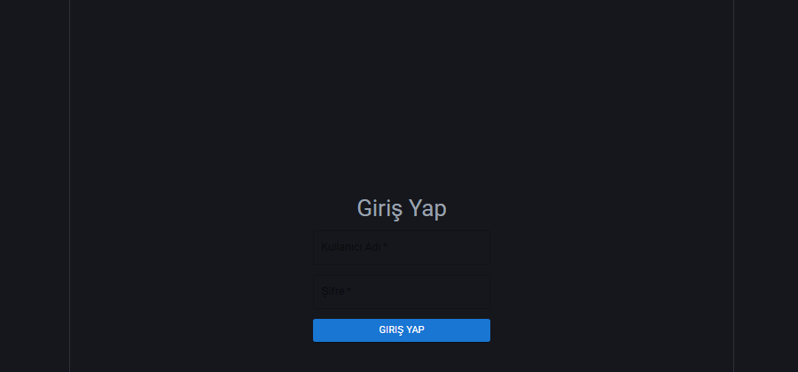
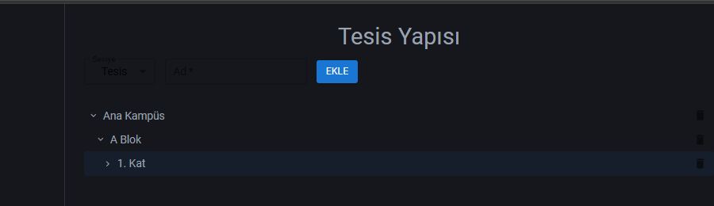
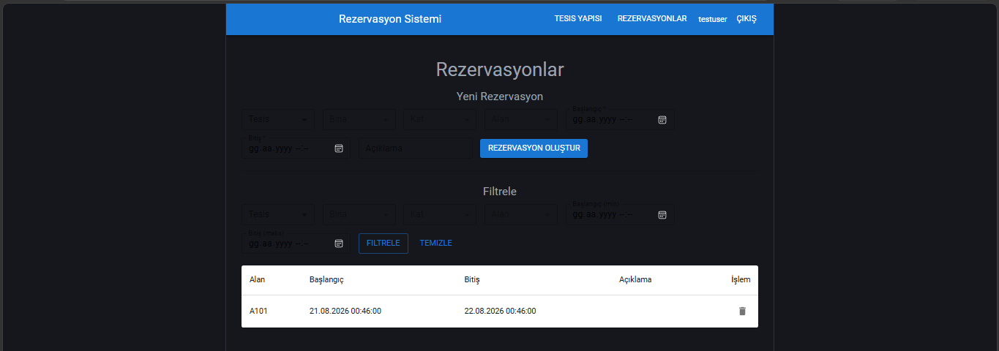
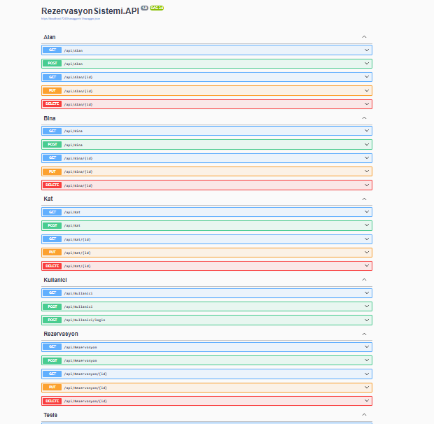

# Tesis Rezervasyon Yönetim Sistemi

Staj projesi kapsamında geliştirilen, kurumsal bir tesis içindeki fiziksel alanların (Tesis → Bina → Kat → Alan) hiyerarşik olarak tanımlandığı ve bu alanlar için zaman bazlı rezervasyon yapılabilen bir web uygulaması.

## Kullanılan Teknolojiler

**Backend:** ASP.NET Core Web API (.NET 8), Entity Framework Core, SQL Server, LINQ
**Frontend:** React 19 + TypeScript, Vite, Material UI (MUI), React Router, Axios
**Kimlik Doğrulama:** BCrypt.Net-Next ile şifre hashleme

## Modüller

- **Giriş Sistemi** — Login, şifre hashleme, korumalı sayfalar, çıkış işlemi
- **Tesis Yapısı** — Tesis → Bina → Kat → Alan hiyerarşisi, tree view, tam CRUD, iş kuralları
- **Rezervasyon** — Basamaklı seçim, çakışma kontrolü, listeleme, filtreleme

## Proje Yapısı
RezervasyonSistemiProjesi/
├── RezervasyonSistemi.API/ → Backend (ASP.NET Core Web API)
└── rezervasyon-frontend/ → Frontend (React + TypeScript)

## Kurulum

### Backend
1. `RezervasyonSistemi.API.sln` dosyasını Visual Studio 2022 ile aç
2. `appsettings.json` içindeki `ConnectionStrings > DefaultConnection` değerini kendi SQL Server örneğine göre düzenle
3. Package Manager Console'da `Update-Database` komutunu çalıştırarak veritabanını oluştur
4. F5 ile projeyi çalıştır (Swagger arayüzü otomatik açılır)

### Frontend
1. `rezervasyon-frontend` klasöründe terminal aç
2. `npm install` ile bağımlılıkları yükle
3. `npm run dev` ile geliştirme sunucusunu başlat (http://localhost:5173)

Detaylı dokümantasyon için proje dosyalarında yer alan Word belgesine bakabilirsiniz.sss

## Ekran Görüntüleri

### Giriş Ekranı

### Tesis Yapısı (Tree View)

### Rezervasyonlar

### API (Swagger)
